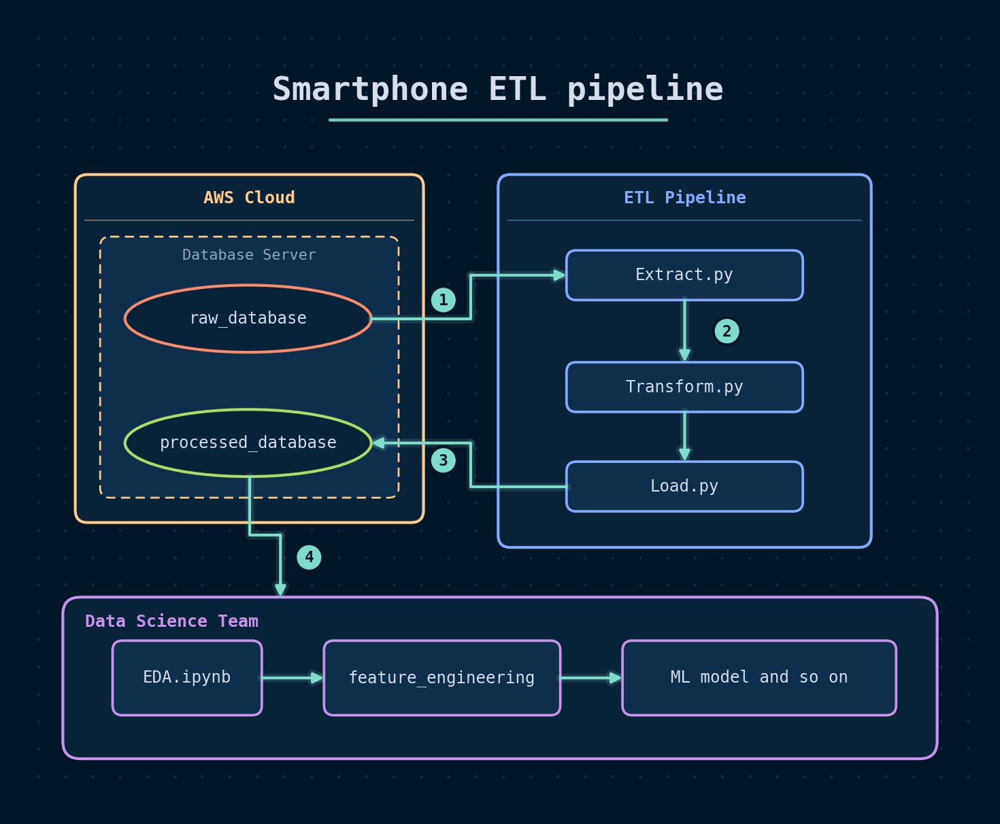
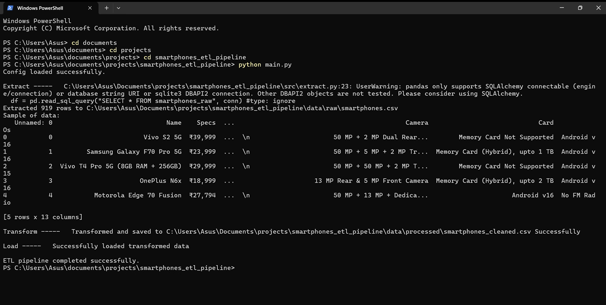
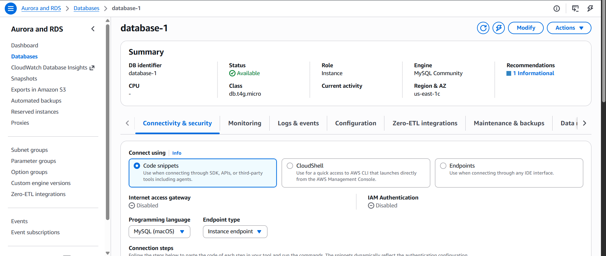

# Smartphones ETL Pipeline 

A small ETL project that I made to understand how data actually moves in a real scenario, from a raw source to a cleaned database that a data science team can directly use. Not just cleaning data inside a notebook and calling it a day.

**GOAL ?**
  - collect smartphone data once and keep it as raw data on a cloud database (AWS RDS - MySQL)
  - build a pipeline that extracts it, cleans it and loads it into a separate clean database
  - do EDA on the clean data and find some meaningful insights

> **NOTE :** for those who don't know - ETL means **E**xtract, **T**ransform, **L**oad. Take the data from a source (extract), clean it and change it to a usable format (transform), put it somewhere it can be used (load).

---

## Architecture



Workflow :
  1. **extract** - `extract.py` reads the raw data from that server
  2. **transform** - `transform.py` cleans it and brings it to a format that the data science team can use
  3. **load** - `load.py` loads the clean data into another (*clean*) database in the same database server
  4. **export** - a cleaned snapshot is kept in `data/processed/` so the EDA can run without the server
  5. **EDA** - `EDA.ipynb` performs exploratory data analysis after loading the cleaned data form the RDS server(from data science team).
`main.py` runs extract --> transform --> load one by one. If any stage fails the pipeline stops there.

## Screenshots

| pipeline run | database on AWS |
|---|---|
|  |  |

## Project structure

```
smartphones_etl_pipeline/
├── data/
│   └── processed/
│       └── smartphones_cleaned.csv   
├── docs/                      # architecture diagram + screenshots
├── notebooks/
│   └── EDA.ipynb
├── scrape/                   # one time scraping for raw data generation - Not pushed
├── src/
│   ├── extract.py
│   ├── transform.py
│   └── load.py
├── .env.example
├── .gitignore
├── config.py
├── main.py
└── requirements.txt
```

> **NOTE :** I deleted my RDS instance after testing because AWS keeps charging for a database even if you are not using it. So you need your own MySQL server to run `main.py`. The EDA part does not need any server.


## EDA

`notebooks/EDA.ipynb` runs independently on `data/processed/smartphones_cleaned.csv`. It follows univariate --> bivariate --> multivariate analysis. 
and below are the key Insights I found :

  - 5G label alone does not make a smartphone completely 5G. While calling, 5G may switch to 4G lines resulting in lower internet and connection speed — but if your smartphone has the Vo5G feature, it shall continue on 5G lines.
  - The uprising in prices for phones having processor_cores == 6 is because of Apple. Apple often uses 6-core processors.
  - 2GB RAM phones show a higher average price than 3GB and 4GB because the Apple iPhone 8 (price ~77k) sits in the 2GB group, and there are only 7 phones in that group so the mean was pulled up. The median price goes in the right order (7.5k, 10.4k, 14k). Same reason for 18GB < 16GB — there is only one 18GB phone (ASUS ROG Phone 5s Pro, 79,999).
  - Battery has almost no link with price, instead it has a slight negative correlation (~ -14). It's because budget price phones provide more battery capacity as a marketing strategy, but premium phones still stay mostly with 5000–7000 mAh batteries.
  - Single SIM smartphones are offered by either Apple or foldable premium phones. That's why there is a big difference between the mean of price of dual SIM smartphones and single SIM smartphones.
  - NFC is almost only a 5G thing: 51% of 5G phones have NFC but only 6% of 4G phones have it. So NFC, 5G and a higher price all come together.
  - RAM, storage and clock speed are also linked with each other — which is very self-explanatory. They are the biggest links with price (clock speed 0.83, RAM 0.81, storage 0.80), followed by NFC 0.64, charging 0.59, front camera MP 0.56, network (5G) 0.53 and eSIM 0.51.
  - card_supported is the only strong negative correlation with price (-0.72). It is even more negative with clock speed (-0.74), RAM (-0.61) and storage (-0.60). As fast as the processor speed will be, the more chance there will be absence of a card slot — modern premium phones almost all drop the card slot.
  - NFC, 5G and price move together across brands too. Brands like Google and Apple provide NFC 100% of the time, at least for this dataset. Exynos is used only by Samsung (67 phones, plus Snapdragon 64 and Dimensity 27), Realme and Oppo mostly use Dimensity (75 and 72 phones), while Xiaomi, Motorola and OnePlus mostly use Snapdragon.

## Tech used
  - Python, pandas, numpy, matplotlib, seaborn
  - MySQL on AWS RDS
  - Jupyter Notebook, Git & GitHub

## what I learned ?
  - How data analyst/scientist do EDA. from univariate to bivariate to mutivarite Analysis.
  - get to know so much domain knowledge that i didn't had earlier like Vo5G, NFC, IR_Blaster, marketing strategies for smartphones selling, big comapanies that spans over the smartphones Industry
  - first time get to know how median can be better representation of typical price over mean
  - i didn't understand How real ETL flow works before but now i am much confident
  - understood the value and usefulness of visualizations and charts(specially box plots & Heatmap). how they help us to detect outliers in dataset and find the correlation between two attributes.

## Note
  - The data was scraped one time from a public website that lists smartphone specs, only for learning purpose, and is used for learning and practicing purposes only. data is not shared in `data/processed/`, also this repo is for read-only and that is why i didn't included the section "How to run: " you can take reference from already ran EDA file.

---
Made by **Vishal Kumar Pathak** - B.Tech CSE student | GitHub - [VishalPathak01](https://github.com/VishalPathak01)
